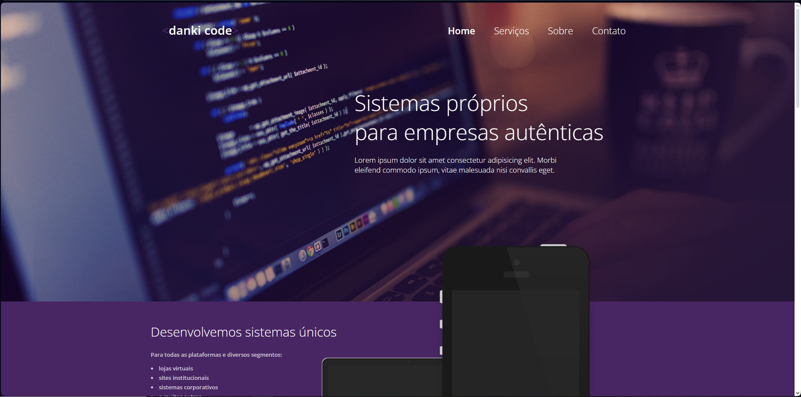
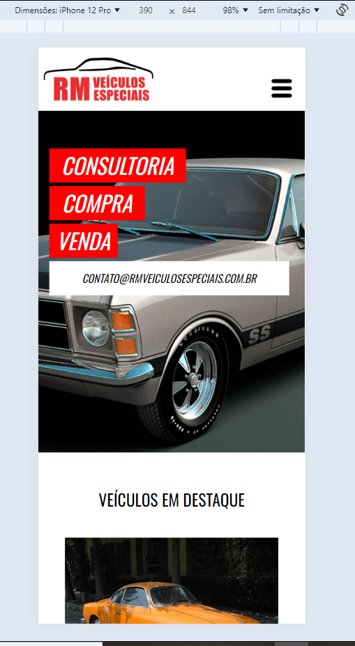

# Projetos do curso Front-end da danki-code
Este repositório contém todos os projetos desenvolvidos durante o curso de Front-end da danki-code. Algumas das tecnologias que foram ultilizadas nesses projetos: HTML, CSS, JavaScript, jQuery, bootstrap, materialize.

# danki code(landing page)

Este é meu primeiro projeto prático usando HTML e CSS, onde apliquei os fundamentos que aprendi. O objetivo foi criar uma página web simples e estilosa, focada em entender a estrutura de elementos HTML e como utilizar CSS para layout e estilo. No projeto, trabalhei com cabeçalhos, parágrafos, links, imagens e estilização básica, explorando propriedades de cores, fontes e posicionamento.

Veja o projeto
Clique <a target="_blank" href="https://deyvisonr.github.io/projetos-curso-danki-code/projeto_01">aqui</a> e veja o projeto funcionando.

# cotedazulvile

Neste segundo projeto, aprofundei minhas habilidades em HTML e CSS, explorando conceitos mais avançados. Ultilizei HTML semântico para melhorar a acessibilidade e a estrutura do código. Também explorei o uso do flexbox para criar um layout mais flexível e responsivo, permitindo que o conteúdo se adapte bem a diferentes tamanhos de tela.. Esse projeto representa meu progresso no desenvolvimento de interfaces web e na criação de designs mais sofisticados e funcionais.

Veja o projeto
Clique <a target="_blank" href="https://deyvisonr.github.io/projetos-curso-danki-code/projeto_02">aqui</a> e veja o projeto funcionando.

# danki code(landing page 2)

Este projeto foi desenvolvido para reforçar e consolidar as habilidades em HTML e CSS que já aprendi.

Veja o projeto
Clique <a target="_blank" href="https://deyvisonr.github.io/projetos-curso-danki-code/projeto_06/">aqui</a> e veja o projeto funcionando.

# danki code(landing page 3)

Neste projeto, continuei a praticar e a aperfeiçoar as habilidades que já adquiri em HTML e CSS. Este projeto é mais uma etapa no meu processo de solidificar conhecimentos e aprimorar a consistência e fluidez no desenvolvimento de interfaces web.

Veja o projeto
Clique <a target="_blank" href="https://deyvisonr.github.io/projetos-curso-danki-code/projeto_10/">aqui</a> e veja o projeto funcionando.

# página inicial do facebook

Este projeto foi desenvolvido como parte do meu curso, com o objetivo de recriar a página inicial clássica do Facebook. Utilizando HTML e CSS, trabalhei na replicação de layout e estilo da versão antiga da interface, focando em elementos como formulários de login, estrutura de cabeçalho e organização do conteúdo. Esse desafio me ajudou a entender melhor o processo de recriação de design, aprimorar minhas habilidades de posicionamento e reforçar o uso de estilos consistentes para interfaces de usuário.

Veja o projeto
Clique <a target="_blank" href="https://deyvisonr.github.io/projetos-curso-danki-code/facebook">aqui</a> e veja o projeto funcionando.

# danki code(landing page 4)

Neste projeto, comecei a trabalhar com APIs, utilizando a API do Google Maps para integrar mapas interativos no site. Além disso, desenvolvi o site com um layout responsivo e incluí animações de slide e um menu com efeito de slide toggle, utilizando jQuery para simplificar a implementação e controle das funcionalidades. Esse projeto foi uma excelente oportunidade para aprender a utilizar APIs externas e usar jQuery, além de explorar funcionalidades de interação, reforçando também minhas habilidades em design responsivo.

Veja o projeto
Clique <a target="_blank" href="https://deyvisonr.github.io/projetos-curso-danki-code/projeto_03">aqui</a> e veja o projeto funcionando.

# site institucional de uma dentista

Este projeto foi desenvolvido com foco em interatividade e dinamicidade, explorando três tipos diferentes de sliders, incluindo a integração do Slick Slider para uma experiência de navegação suave e estilizada. Também incluí vídeos no layout para enriquecer o conteúdo visual e utilizei jQuery para facilitar a implementação dos sliders e adicionar funcionalidades interativas. Esse projeto foi uma ótima oportunidade para praticar a manipulação do DOM com jQuery e aprimorar minhas habilidades em incorporar e personalizar plugins de slider.

Veja o projeto
Clique <a target="_blank" href="https://deyvisonr.github.io/projetos-curso-danki-code/projeto_04">aqui</a> e veja o projeto funcionando.

# rm veiculos(site institucional)

Neste projeto, desenvolvi páginas individuais para cada item do menu, mantendo uma consistência visual em todo o site através do uso de uma tipografia e estilo de texto uniformes, aplicando conceitos de UI/UX. Além disso, implementei um sistema de busca pronto para o back-end, incluindo uma barra de pesquisa para filtrar carros por preço e checkboxes para filtrar por ano na página de venda. Esse projeto foi essencial para aprofundar meus conhecimentos em organização de interface e design intuitivo, além de preparar uma funcionalidade robusta de busca para futura integração.

Veja o projeto
Clique <a target="_blank" href="https://deyvisonr.github.io/projetos-curso-danki-code/projeto_05/home.html">aqui</a> e veja o projeto funcionando.

# landing page(mockup)

Este projeto é uma landing page básica criada como mockup para explorar o desenvolvimento com o Materialize CSS. O foco foi testar os componentes e a estrutura oferecidos pelo Materialize para criar layouts responsivos e modernos de forma rápida. Este projeto ajudou a entender como utilizar essa biblioteca para estilização e organização de elementos, facilitando o desenvolvimento de interfaces clean e funcionais.

Veja o projeto
Clique <a target="_blank" href="https://deyvisonr.github.io/projetos-curso-danki-code/projeto_07/">aqui</a> e veja o projeto funcionando.

# landing page de uma dentista

Neste projeto, o foco foi a aplicação de habilidades avançadas em CSS para criar elementos visuais personalizados e estilizar o site de forma detalhada.

Veja o projeto
Clique <a target="_blank" href="https://deyvisonr.github.io/projetos-curso-danki-code/projeto_09/">aqui</a> e veja o projeto funcionando.

# spotify

Neste projeto, recriei a interface clássica do Spotify, implementando um design responsivo e interativo. A interface permite que, ao clicar em uma música, um player apareça na parte inferior da tela, exibindo informações sobre a faixa selecionada. Adicionei controles personalizados ao player, incluindo botões para play/pause e uma barra de progresso para controlar a posição da música em reprodução. Esse projeto foi uma ótima oportunidade para aprimorar minhas habilidades em design de interface responsiva e funcionalidades de interação, além de explorar o desenvolvimento de um player de música com controles customizados.

Veja o projeto
Clique <a target="_blank" href="https://deyvisonr.github.io/projetos-curso-danki-code/spotify/">aqui</a> e veja o projeto funcionando.

# dashboard

Este projeto é uma dashboard desenvolvida como uma SPA (Single Page Application), com o objetivo de aplicar e reforçar meus conhecimentos em requisições assíncronas usando AJAX e Fetch API. A interface carrega dados dinamicamente, proporcionando uma experiência de navegação fluida e sem recarregamentos completos da página. Esse projeto foi uma excelente oportunidade para explorar técnicas modernas de carregamento de dados e aperfeiçoar minhas habilidades no desenvolvimento de aplicações web interativas e rápidas.

Veja o projeto
Clique <a target="_blank" href="https://deyvisonr.github.io/projetos-curso-danki-code/projeto_11/">aqui</a> e veja o projeto funcionando.